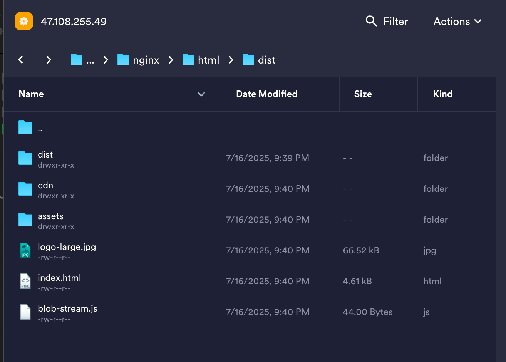

# Resume King - 简历王！智能简历制作工具

http://47.108.255.49:3000/ 线上体验！！！

一个基于 Vue 3 + Springboot 的在线简历制作工具，提供所见即所得的简历编辑体验。

## 最新更新
- ✨ 新增简历 ID 固定显示功能
  - 保存后 ID 持久显示在界面
  - 支持一键复制简历 ID
- 🛡️ 添加接口限流保护
  - 前端按钮防连点（2秒内）
  - 后端接口限流（1秒1次）
- 🎨 优化用户界面
  - 新增一键清空画布功能
  - 优化组件拖拽体验
  - 完善撤销/重做功能
- 📝 增强文本编辑
  - 支持文本组件自适应大小
  - 优化文本编辑交互
- 🖼️ 增强图片功能
  - 新增公司 Logo 快速导入
  - 优化图片上传体验
- 🤖 AI 智能优化
  - 支持简历内容 AI 优化
  - 智能排版建议

## 功能特性

- 🎨 多种精美简历模板
  - 现代简约风格
  - 专业商务风格
  - 创意设计风格
  - 作者强推模板
- ✏️ 所见即所得的编辑体验
  - 拖拽式组件布局
  - 实时预览
  - 组件大小调整
  - 文本样式自定义
  - 撤销/重做操作
  - 一键清空画布
- 📝 丰富的组件类型
  - 文本组件（标题、正文、段落）
  - 图片组件（支持上传和裁剪）
  - 分隔线组件（实线、虚线、点线、渐变）
  - 支持组件多选和批量操作
- 💾 数据管理
  - 自动保存到本地存储
  - 支持导出/导入简历数据
  - 云端数据同步
  - 简历ID固定显示和一键复制
  - 防止频繁保存的限流保护
- 📄 导出功能
  - 导出为 PDF 文件
  - 支持自定义 DPI 和清晰度
  - 支持自定义页面大小和边距
- 🖼️ 图片处理
  - 支持图片上传到阿里云 OSS
  - 图片代理服务，解决跨域问题
  - 图片压缩和优化
  - 支持公司 Logo 快速导入
- 🤖 智能功能
  - AI 文本优化
  - 智能排版建议
  - 简历内容推荐

## 技术栈

### 前端
- Vue 3 - 渐进式 JavaScript 框架
- TypeScript - JavaScript 的超集
- Vite - 下一代前端构建工具
- Pinia - Vue 的状态管理库
- Element Plus - 基于 Vue 3 的组件库
- PDFKit - PDF 生成库

### 后端
- Spring Boot 3.x - Java 后端框架
- MyBatis - ORM 框架
- MySQL - 关系型数据库
- 阿里云 OSS - 对象存储服务

## 项目设置

### 环境要求
- Node.js >= 16.0.0
- Java >= 11
- MySQL >= 8.0

### 前端开发环境设置
```bash
# 进入前端目录
cd frontend

# 安装依赖
npm install

## 启动开发服务器
#npm run dev
#
## 构建生产版本
#npm run build

## 跳过类型检查构建（开发阶段）
#npx vite build
```

### 后端开发环境设置
```bash
# 进入后端目录
cd backend

# 使用 Maven 安装依赖
mvn install

# 运行应用
mvn spring-boot:run
```

### 配置文件
1. 前端配置
  - 在 `frontend/.env` 文件中配置环境变量
  - 在 `frontend/src/config` 目录下配置应用参数

2. 后端配置
  - 在 `src/main/resources/application.yml` 中配置数据库和 OSS
  - 配置阿里云 OSS 的访问密钥和 Bucket 信息

## 项目结构
```
resume_king/
├── frontend/                # 前端项目
│   ├── src/
│   │   ├── components/     # Vue 组件
│   │   ├── store/         # Pinia 状态管理
│   │   ├── template/      # 简历模板
│   │   └── utils/         # 工具函数
│   └── public/            # 静态资源
└── backend/               # 后端项目
    ├── src/
    │   ├── controller/    # 控制器
    │   ├── service/      # 服务层
    │   ├── mapper/       # MyBatis 映射
    │   └── entity/       # 实体类
    └── resources/        # 配置文件
```

## 使用指南

### 创建新简历
1. 点击"新建简历"按钮
2. 选择喜欢的模板
3. 开始编辑内容

### 编辑简历
1. 拖拽组件到画布
2. 调整组件位置和大小
3. 编辑文本内容和样式
4. 上传和调整图片

### 导出简历
1. 点击"导出"按钮
2. 选择导出格式（PDF）
3. 等待生成完成
4. 下载文件

## 开发指南

### 添加新模板
1. 在 `frontend/src/template` 目录下创建新模板文件
2. 实现模板组件配置
3. 在模板选择器中添加新模板

### 添加新组件
1. 在 `frontend/src/components` 目录下创建新组件
2. 实现组件逻辑和样式
3. 在组件选择器中注册新组件

## 贡献指南
1. Fork 项目
2. 创建特性分支
3. 提交更改
4. 推送到分支
5. 创建 Pull Request

## 许可证
MIT License

## 联系方式
- 项目维护者：[mp9]
- 邮箱：[1353632408@qq.com]
- CSDN：[mp9只想干开发]


# 部署后端docker镜像 

打包 package后端jar包  在同目录下执行   docker build -t resume_backend -f Dockerfile.backend .

运行

docker run -d -p 8080:8080 --name resume_back --network resume resume_backend


# 部署前端docker镜像

cd frontend

npx vite build

1.将前端打包为 dist 放到  /mydata/nginx/html/dist 目录下

nginx配置放到   /mydata/nginx/conf/nginx.conf 目录下


docker run -d \
--name nginx \
-p 3000:3000 \
-v /mydata/nginx/html/dist:/usr/share/nginx/html \
-v  /mydata/nginx/conf/nginx.conf:/etc/nginx/nginx.conf \
--network resume \
nginx


# shardingproxy
docker pull apache/shardingsphere-proxy:5.5.2

docker run -d --name tmp --entrypoint=bash apache/shardingsphere-proxy:5.5.2

docker cp tmp:/opt/shardingsphere-proxy/conf /mydata/shardingproxy/conf

docker run -d \
-v /mydata/sharding-prox/conf/:/opt/shardingsphere-proxy/conf \
-v /mydata/sharding-prox/ext-lib:/opt/shardingsphere-proxy/ext-lib \
-e ES_JAVA_OPTS="-Xmx128m -Xms128m -Xmn64m" \
-p 3321:3307 \
--name server-proxy-a \
--network resume \
apache/shardingsphere-proxy:5.4.1

mv mysql-connector-java-8.0.22.jar  /mydata/sharding-prox/ext-lib/

